```{r, include = FALSE}
knitr::opts_chunk$set(
  collapse = TRUE,
  comment = "#>",
  fig.width = 6,
  fig.height = 4
)
```

## Motivation

Since 1973, the U.S. Rehabilitation Services Administration (RSA) has partnered with state vocational rehabilitation (VR) agencies to help individuals with disabilities achieve meaningful employment and independence. RSA-911 datasets play a crucial role in this effort by capturing detailed participant data, but their complexity can hinder effective analysis.

To simplify this process, we present the \texttt{rsa.helpr} software package to streamline the cleaning and analysis of RSA-911 and Transition Readiness Toolkit (TRT) data, a new measure of program effectiveness. We also deliver a user-friendly dashboard, empowering both VR researchers and counselors with the opportunity to conduct analyses. Using our developed tools, we explore the relationships between RSA-911 and TRT data, providing insights into the expanding TRT initiative. 

Together, our tools enhance efficiency, accessibility, and reproducibility in VR data analysis. Freely available and compatible with any RSA-911 and TRT dataset, our software provides a flexible framework for VR research, fostering consistency and adaptability while supporting future studies.


## Installation and Loading
The package can be installed with the following code:
```{r setup, eval = FALSE}
devtools::install_github("rtaylor456new/rsa.helpr")
```

After being installed, we can load the package:
```{r load}
library(rsa.helpr)
```


## Data and Challenges

As each RSA-911 dataset involves data entry by many providers across several VR agencies, the risk of erroneous or missing values is high. Using the codebook as the guide, we searched the variables for values that would need to be adjusted or could be re-coded for more meaning. These incorrect values were then replaced with either a reasonable alternative or missing values. While some missing values represent truly missing data, many of the "NULL" values in RSA-911 datasets actually represent a factor value. These values have been represented with meaningful factor levels for the sake of analysis. Several variables were wholly removed for either containing no meaningful data or unnecessary information. Some additional variables were created during this process to measure variables of interest, for example, enrollment lengths and grade levels. 

Luckily, each quarterly dataset follows the same required variable
naming conventions, allowing us to focus on examining the values within the variables. With
498 variables in the raw data, it follows that there are patterns of similar variable structures. For instance, certain variables that contain "amt" somewhere in the name correspond to monetary amounts, and variables that contain "provide" or "provided" somewhere in the
name correspond to binary values indicating a service, accommodation, enrollment, etc. was
or was not provided. These convenient clusters of variable types were among the simpler to
investigate. For the majority of variables, which did not have an obvious naming similarity
or structure, the values and corresponding keys within the codebook were combed. After
thorough examination of all variables, more groupings were discovered, to help with eventual
cleaning standardization.

As the scores data are newly collected
and therefore contain a fraction of the participants with RSA-911 data, the size is significantly smaller. More importantly, the scores data consist of a concise list of variables--namely the scores for each service, the dates completed, and the itemized reports from each pre and post evaluation. Our focus in cleaning is the restructuring the format of the scores data and variable names to ensure a smooth merge with the quarterly RSA-911 data. Additionally, new variables must be created to aid with analysis, most importantly, median difference score, which is the median per individual across all of their specific service difference scores. This allows for more a more populated and simple response variable to measure.

## Solution: Data Cleaning Package `rsa.helpr`

To achieve the standardization and simplification of data cleaning, our R package, 
`rsa.helpr`, has been developed alongside the process of data preparation. This package provides the opportunity to not only bypass the tedious process of data cleaning, but also to create directly reproducible results.

### Helper Functions
#### `load_data`
This function reads in and combines RSA-911 datasets from a user-inputted 
directory, preparing them for cleaning steps. All the user must do is identify
the file path in which the data are stored, `load_data` does the rest by automatically searching for appropriate datasets based on common naming
structures. Not only does this process cut down the steps and time required to
individually load and combine many datasets in R, it also provides the option 
for the user to load data directly from a Box-protected storage folder. 
This may be relevant to maintain security of IRB-protected datasets.


Additionally, `load_data` allows the user to specify any of data 
files to be excluded, using the optional function argument `files`. Once 
`load_data` captures all correct data files, it merges the datasets based on 
common variables. (For variables not common to all datasets, the columns are
retained and created as NULL columns for datasets without overlap.)

The following example depicts a usage of the function with default settings.
Here, the user has now stored the large, combined dataset in R called `data`.
```{r load_data, eval = FALSE}

data <- load_data("C:\\Users\\Some Username\\Optional Box Folder\\Folder name")

```

The next example demonstrates how to use the `files` argument to specifically
bypass select data file(s).
```{r load_data2, eval = FALSE}

data <- load_data("C:\\Users\\Some Username\\Optional Box Folder\\Folder name",
                  files = c("PY2020Q1.csv", "PY2020Q3.csv"))

```

Lastly, the following code provides an example of using the third function
argument, `download_csv`. When set to `TRUE`, `download_csv` results in the 
function outputting a csv file of the new, combined dataset to the working
directory. This is a good option when the user plans to reload the reload the
large, combined dataset in many sessions, without a concern for keeping the
data on Box.

```{r load_data3, eval = FALSE}

data <- load_data("C:\\Users\\Some Username\\Optional Box Folder\\Folder name",
                  download_csv = TRUE)

```


### Helper Functions
Through the process of data cleaning, small functions were created to handle specific variable
cleaning problems. These functions serve as helper functions for repeated cleaning tasks within larger functions in `rsa.helpr`. However, all of these helper cleaning functions can be used individually, as demonstrated in the proceeding sections. Some examples of the 
helper functions are shown below:

#### `handle_nines` (vector input)
This function is mainly applied to binary variables, with 2 levels and a missing
value represented by a 9. This function replaces ensures missing values are 
represented by 9s, and when `unidentified_to_0` = TRUE, it combines the 9s with
0s.
```{r handle_nines}

head(rsa_simulated$E14_White_911, 10)

var_clean <- handle_nines(rsa_simulated$E14_White_911, unidentified_to_0 = TRUE)
head(var_clean, 10)

```

#### `handle_code` (vector input)
This function handles code variables, replacing NULL, NA, blanks, etc. with NA
values in R. This is utilized for consistency and the opportunity to analyze 
the distribution of missing information.

```{r handle_code}

head(rsa_simulated$E18_Postal_Code_911, 10)

var_clean <- handle_code(rsa_simulated$E18_Postal_Code_911)
head(var_clean, 10)

```

#### `handle_values` (vector input)
This function is one of the more flexible handle functions, as it allows the 
user to input the allowed values for a variable, as well as the accepted value
to represent a missing value, through the `blank_value` parameter. The following
example involves a variable which allows values 1, 2, 3, 4, where blanks should
be 0s. (`blank_value` defaults to NA.)
```{r handle_values}

head(rsa_simulated$E99_JobExploration_Vendor_911, 20)

var_clean <- handle_values(rsa_simulated$E99_JobExploration_Vendor_911, 
                           values = c(1, 2, 3, 4), blank_value = 0)
head(var_clean, 20)

```


#### `handle_abbrev` (vector input)
This function cleans up a name variable, allowing for a wide variety in value
structure and abbreviates each value. When the value is already shortened or
abbreviated, it is left alone; otherwise, the value is abbreviated with an 
acronym, ignoring articles and prepositions.
```{r handle_abbrev}

tail(scores_simulated$Provider, 10)

var_clean <- handle_abbrev(scores_simulated$Provider)
tail(var_clean, 10)

```


#### `handle_splits` (vector input)
This function is used to separate variables with values including special 
characters. It allows for differing lengths of values (e.g. 1, 1;2, 3;3;4, NA).
It separates by the identified special character and creates new variables, 
based on the original name, with one value per column.
```{r handle_splits}

head(rsa_simulated$E395_App_Medical_911)

var_clean <- handle_splits(rsa_simulated$E395_App_Medical_911, 
                           var_name = "E395_App_Medical_911")
lapply(var_clean, head)

```

#### `apply_handle_splits`  (data frame input)
This function allows the user to apply the `handle_splits` function across 
multiple variables in a dataset. Rather than intaking a vector input, the user
applies this function to an entire data frame. 
```{r apply_handle_splits}

rsa_subset <- rsa_simulated[, c("E395_App_Medical_911", "E396_Exit_Public_Support_911", 
                      "E142_FourYear_Comp_911")]

special_cols <- c("E395_App_Medical_911", "E396_Exit_Public_Support_911",
                  "E142_FourYear_Comp_911")

df_clean <- apply_handle_splits(rsa_subset, special_cols, sep = ";")
head(df_clean, 10)

```


#### `separate_disability` (data frame input)
This function intakes an entire dataset, identifies special disability columns,
and separates them into meaningful individual value columns. Unlike the 
`apply_handle_splits` function, this function deals with the Primary_Disability
and Secondary_Disability variables, which contain specifically 2 values in a 
uniform structure.

```{r separate_disability}
head(rsa_simulated$E43_Primary_Disability_911, 10)
head(rsa_simulated$E44_Secondary_Disability_911, 10)

data_clean <- separate_disability(rsa_simulated[1:100])

head(data_clean$Primary_Cause, 10)
head(data_clean$Primary_Impairment, 10)

head(data_clean$Secondary_Cause, 10)
head(data_clean$Secondary_Impairment, 10)
```


### One-Stop Cleaning Functions
As the underlying premise of this package design is reproducibility and simplicity, two main
functions were created to encompass all necessary cleaning steps in one run. Functions
`clean_utah` and `clean_scores` yield fully cleaned datasets, each with a single function call.
These complicated functions do all of the work under the hood for the user, enlisting the
helper functions, additional restructuring steps, and type classification. These functions
utilize regular expressions in order to make variable identification robust against naming
differences. They also include checks to handle conflicts in expected and and observed variable
structures. `clean_utah` and `clean_scores` can be run simply, by inputting only the dataset
and no other arguments, using default settings, as shown below:

#### clean_utah
The following code demonstrates the simplicity of running the one-stop cleaning
function for quarterly (Utah RSA-911) data, using defaults.
```{r clean_utah, eval = FALSE}
rsa_clean <- clean_utah(rsa_simulated)
```


###### `aggregate`
The `aggregate` parameter of the `clean_utah` function removes duplicate rows 
for participants per quarter. It defaults to TRUE, and when set to TRUE, we 
retain only the most recent row per quarter across participants.
```{r aggregate}
dim(rsa_simulated)

rsa_clean <- clean_utah(rsa_simulated, aggregate = TRUE)
dim(rsa_clean)

```


###### `unidentified_to_0`
The `unidentified_to_0` parameter of the `clean_utah` function converts missing
values in various forms to 0 for appropriate variables when set to TRUE (TRUE is
the default). In the following example, we show a binary variable which uses 9s
to identify missing values. In our cleaning function, we would have first 
cleaned the variable to only use 9s to represent missings, then convert to 0.
```{r unidentified_to_0}
rsa_clean <- clean_utah(rsa_simulated, unidentified_to_0 = TRUE)
head(rsa_clean$E42_Has_Disability_911)

rsa_clean <- clean_utah(rsa_simulated, unidentified_to_0 = FALSE)
head(rsa_clean$E42_Has_Disability_911)

```


###### `remove_desc`
The `remove_desc` parameter of the `clean_utah` function removes unnecessary
descriptor variables when set to TRUE, the default. These descriptor variables 
include the meanings for symbolic numeric values, but they can be distracting 
and bulky. An example of removing the variables is shown below.
```{r remove_desc}

names(rsa_simulated)[10:20]

names(rsa_clean)[5:12] 

```

###### `remove_strictly_na`
The `remove_strictly_na` parameter of the `clean_utah` function, when set to
TRUE, removes variables that have exclusively missing values at the end of the 
cleaning process. This parameter defaults to TRUE, as removing unhelpful 
variables and clutter in the data are typical goals of the cleaning process.
```{r remove_strictly_na}

rsa_clean <- clean_utah(rsa_simulated, remove_strictly_na = FALSE)

na_cols <- names(rsa_clean)[sapply(rsa_clean, function(x) all(is.na(x)))]
na_cols

rsa_clean <- clean_utah(rsa_simulated, remove_strictly_na = TRUE)
na_cols <- names(rsa_clean)[sapply(rsa_clean, function(x) all(is.na(x)))]
na_cols
```


#### clean_scores
The following code is an example of running the `clean_scores` function, using 
defaults for ultimate simplicity. Note that when run with defaults, we are 
provided a warning about participant ID values if our data contain multiple
states.
```{r clean_scores, warning=TRUE}

scores_clean <- clean_scores(scores_simulated)

```


###### `state_filter`
The `state_filter` parameter of the `clean_scores` function allows the user to
extract only data from the state(s) of interest. As shown in the above example,
when `state_filter` is not provided, the cleaning function will retain all 
states--if there are multiple--in the data. However, it will append the state 
abbreviation to the ID, as IDs are not unique across states. Below is an example
of cleaning our scores data (which contain multiple states' data), extracting 
only the data from Utah. 
```{r state_filter}
unique(scores_simulated$State)

scores_clean <- clean_scores(scores_simulated, state_filter = "Utah")

```


###### `clean_ID`
The `clean_ID` parameter of the `clean_scores` function defaults to TRUE, and
when set to TRUE, will remove rows of the data where participant ID is missing.
Data with missing IDs often are fully empty rows and are best removed to avoid
errors and clutter.

```{r clean_ID}

scores_clean <- clean_scores(scores_simulated, state_filter = "Utah", 
                             clean_id = TRUE)
sum(is.na(scores_clean$Participant_ID))

```


###### `aggregate`
Similar to the `aggregate` parameter of the `clean_utah` function, the 
`clean_scores` removes duplicate scores for participants per TRT service test. 
It defaults to TRUE, and when set to TRUE, we retain only the most recent score
per TRT service across participants.

```{r aggregate2}
dim(scores_simulated)

scores_clean <- clean_scores(scores_simulated, aggregate = TRUE)
dim(scores_clean)

```


###### `id_col` 
This parameter allows for the user to specify an ID column with a different 
naming structure than expected. We will not run the following code, as our data
do have appropriate ID column names, but below is an example of identifying a 
variable, "X", as our ID column.

```{r ID_col, eval=FALSE}

scores_clean <- clean_scores(scores_simulated, id_col = "X")

```


#### clean_provider
Beyond preparing the TRT scores data for a successful merge with RSA-911 data,
we can restructure TRT scores datasets for independent analysis. Newly collected
variables containing provider information are of interest to researchers. With
these variables, the focus is examining trends across providers, not individual
participants. 

The following code demonstrates applying `clean_provider` using function 
arguments that are also seen and discussed in the previous `clean_scores`
examples.

```{r clean_provider, eval=FALSE}

provider_data <- clean_provider(scores_simulated, state_filter = "Utah",
                                clean_id = TRUE)

```

Below is an example of implementing additional function arguments in 
`clean_provider`. The argument `remove_questions` allows the user to
remove columns related to itemized score data, which are not pertinent to 
provider analysis. `condense` is similar to the `aggregate` argument in
`clean_scores`, as it involves retaining rows by unique values. Unlike 
`aggregate`, `condense` retains the unique combinations of provider and service.
In `clean_provider`, the new sorting column is Provider, rather than 
Participant. 

```{r clean_provider2, eval=FALSE}

provider_data <- clean_provider(scores_simulated, state_filter = "Utah",
                                clean_id = TRUE,
                                remove_questions = TRUE,
                                condense = TRUE)

```


### Merge and Metadata Functions
In order to run analysis to link the effects of the RSA-911 demographic data to the scores
results, we needed to merge and condense our data. Again, functions were created to
handle the mechanics of these processes while maintaining simplistic calls for the user.
`merge_scores` takes cleaned quarterly and scores data and conducts a merge, resulting in
only data corresponding to matched participants. `create_metadata` in turn takes a cleaned,
merged dataset and condenses to metadata, with one row per unique participant. This
function uses the same methods as described in the Data Cleaning section to summarize
(medians, most common occurrences, most recent values).

#### merge_scores
This function is to be run on cleaned RSA-911 quarterly and TRT scores datasets.
Note that this function allows the user to specify the ID variable names in each
dataset being merged, but the defaults are `Participant_ID` for each. 
```{r merge_scores}
rsa_clean <- clean_utah(rsa_simulated, aggregate = FALSE)
scores_clean <- clean_scores(scores_simulated, state_filter = "Utah")

merged_data <- merge_scores(rsa_clean, scores_clean)
dim(merged_data)
```

#### create_metadata
```{r create_metadata}
metadata <- create_metadata(merged_data)
nrow(metadata)
length(unique(metadata$Participant_ID))
```


### Full Data Cleaning Process Example
Below is an example of the process of producing fully cleaned, condensed 
metadata using `rsa.helpr` functions:

```{r example, eval = FALSE}
# Cleaning an RSA-911 datset using defaults
rsa_clean <- clean_utah(rsa_simulated, aggregate = FALSE)

# Cleaning a scores dataset using defaults and extracting only Utah data
scores_clean <- clean_scores(scores_simulated, state_filter = "Utah")

# Merge the datasets, keep only relevant participants, using defaults
merged_data <- merge_scores(rsa_clean, scores_clean)

# Generate the condensed metadata
metadata <- create_metadata(merged_data)

```

These four functions provide any researcher with a completely reproducible process for
preparing data, all with incredible ease.


### Visualization Functions

To support analysis following data preparation, we provide three functions for 
the visualizations we anticipate to be used most often. 

#### visualize_densities
`visualize_densities` greatly simplifies the process of creating a density plot
to compare the distributions across levels of a qualitative variable. While 
other plotting functions in `R` can be easily applied to cleaned variables, 
creating a density plot across categories requires a higher level of coding
proficiency. To provide researchers with less `R` fluency the ability to use 
these valuable plots, the `visualize_densities` function handles all of the 
necessary programming steps internally. The user must simply input the 
quantitative and categorical variables of interest, and the density plot is 
produced, with appropriate labels. The following code provides two examples of
utilizing the function. 
The first, plotting median difference scores across gender, relies on the 
function defaults. This example demonstrates the warnings produced when a level 
of the categorical/grouping variable is too sparse, as well as when level labels
are not provided by the user.

```{r visualize_densities, warning = TRUE}

visualize_densities(metadata$E9_Gender_911,
                               metadata$Median_Difference_Score)
```

The next example, examining exit wages across disability priority levels, shows customizing the plot a bit more using some of
the parameters.
```{r visualize_densities2}
visualize_densities(metadata$E45_Disability_Priority_911,
                               metadata$Median_Difference_Score,
                    cat_var_name = "Disability Priority",
                    num_var_name = "Median Diff. Score",
                    level_labels = c("Not severe", "Severe",
                                     "Highly severe"))
```


The functions `visualize_metadata` and `visualize_scores` offer more extensive
visualizations. These larger functions provide a shortcut to standard 
visualizations, simply requiring the user to input a cleaned dataset and 
selected type of analysis in order to generate a series of exploratory plots. 
A select set of commonly-examined variables are used in these visualizations.

#### visualize_metadata
```{r visualize_metadata}
visualize_metadata(metadata, option = "general_demo",
                              one_window = TRUE)

```


```{r visualize_metadata2, eval = FALSE}

rsa.helpr::visualize_metadata(metadata, option = "investigate_scores",
                              one_window = TRUE)

```

```{r visualize_metadata3}
rsa.helpr::visualize_metadata(metadata, option = "investigate_wage",
                              one_window = TRUE)

```


```{r visualize_metadata4}
rsa.helpr::visualize_metadata(metadata, option = "investigate_employment",
                              one_window = TRUE)

```


#### visualize_scores
```{r visualize_scores}
rsa.helpr::visualize_scores(scores_clean, option = "overview",
                            one_window = TRUE)
```


```{r visualize_scores2}
rsa.helpr::visualize_scores(scores_clean, option = "across_service",
                            one_window = TRUE)
```


```{r visualize_scores3}
rsa.helpr::visualize_scores(scores_clean, option = "across_provider",
                            one_window = TRUE)
```


## An Interactive `rshiny` Data Dashboard
While our `rsa.helpr` package alleviates the burden of data cleaning within R, aiding VR
researchers in their study, the level of accessibility needs to be extended. Beyond VR
researchers, the hope is to allow visibility of summaries and results to those professionals who
are actually working with participants and recording these data. Requiring a familiarity with
R creates a degree of separation between the VR professionals and their data interpretation.
To mitigate this, we have developed an interactive data dashboard, titled "RSA-911 Data Exploration", that will be made accessible
online. This `rshiny` dashboard runs on the `rsa.helpr` package, maintaining a consistent
thread between any analysis run in R or observed in the dashboard.

### Data Upload and Cleaning
The user begins by uploading their desired quarterly RSA-911 and/or scores
dataset(s). The following example shows one RSA-911 large dataset uploaded, but the
user may upload several files at once. Once the datasets are fully uploaded, the dashboard
automatically begins applying the cleaning functions to the data. The adjustable function
arguments are provided as checkbox options for the user. Any time the user adjusts the
selections, the cleaning function will re-run. The status is shown in the progress bars. Once
the datasets are uploaded and fully cleaned, they are stored in the session and displayed with
a dimension summary for inspection.


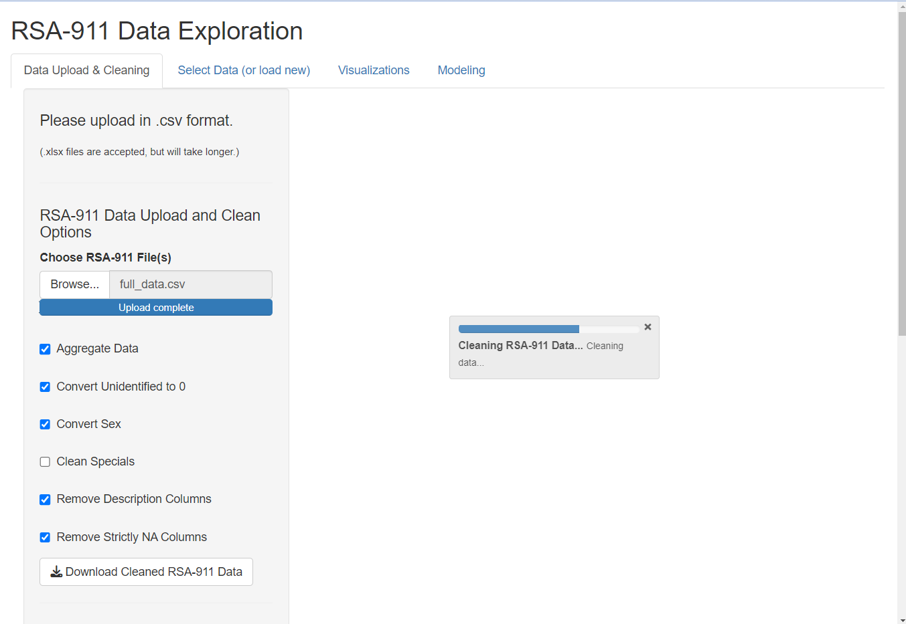{width=500px}

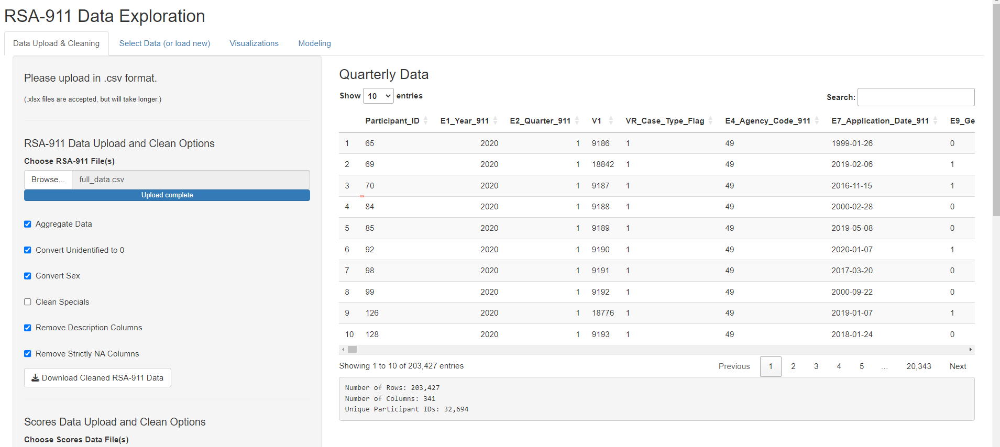{width=500px}

If the user uploads both quarterly and scores data, the dashboard automatically
creates a merged data set, displayed in the main page. As condensing the data is a slower process, the metadata will not be generated automatically. The user may click the "Generate
Metadata" button to initiate this. Again, a progress bar will indicate status and the final data
will be displayed. (Note: the user may choose to create metadata using only the quarterly
data, but this is not the default.)

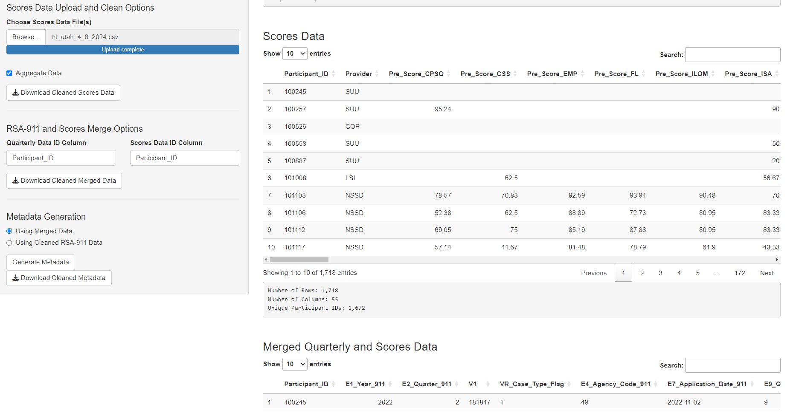{width=500px}
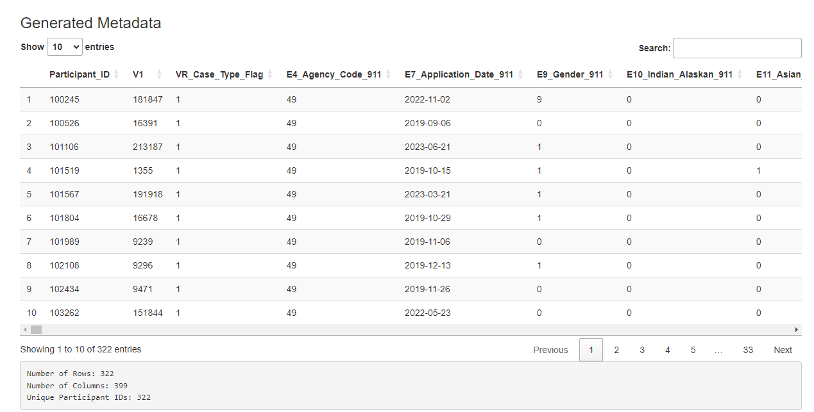{width=500px}

### Selecting a Dataset
Now, with the datasets stored in the session, we choose which one we would like
to visualize and model. The user has the option to upload a new dataset, and select which
type. This is an option provided for a user who has already cleaned the data using the app
and is returning in a new session.

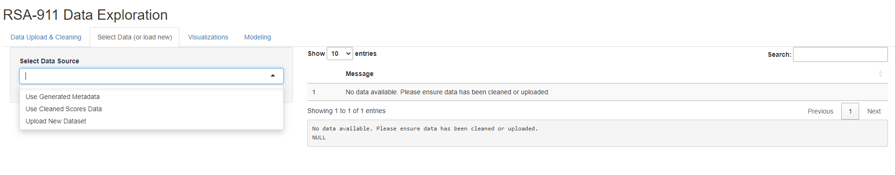{width=500px}

#### Selecting Metadata
Different visualization tabs pop up depending on the dataset selected. When the
user selects "Use Generated Metadata", they have four tabs with many visuals on each to
examine. Some provide general visual summaries of high interest demographics, some provide
visuals relevant to modeling options. This figure provides an example of the output.

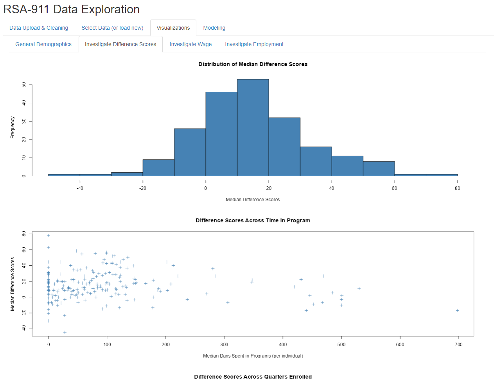{width=500px}

Different modeling options pop up depending on the dataset selected.
When the user selects "Use Generated Metadata", they have the option of fitting OLS
models for predicting Median Difference Score or Ending Wage, or fitting a logistic regression
model for predicting Employment Outcome (1: competitively employed, 0: not competitively
employed). Then, the user can select different combinations of predictors, with the model
being recalculated for each change. Note that this subset of predictors was selected for
simplicity and based on the advice of our collaborator, Dr. Phillips. Once fitted, the model
output will then be shown, as well as its corresponding residual plots.

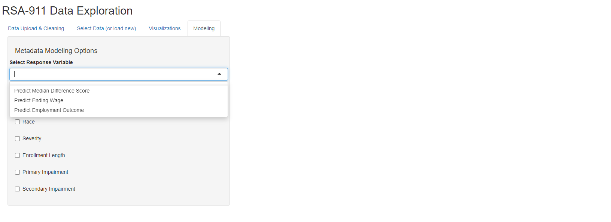{width=500px}

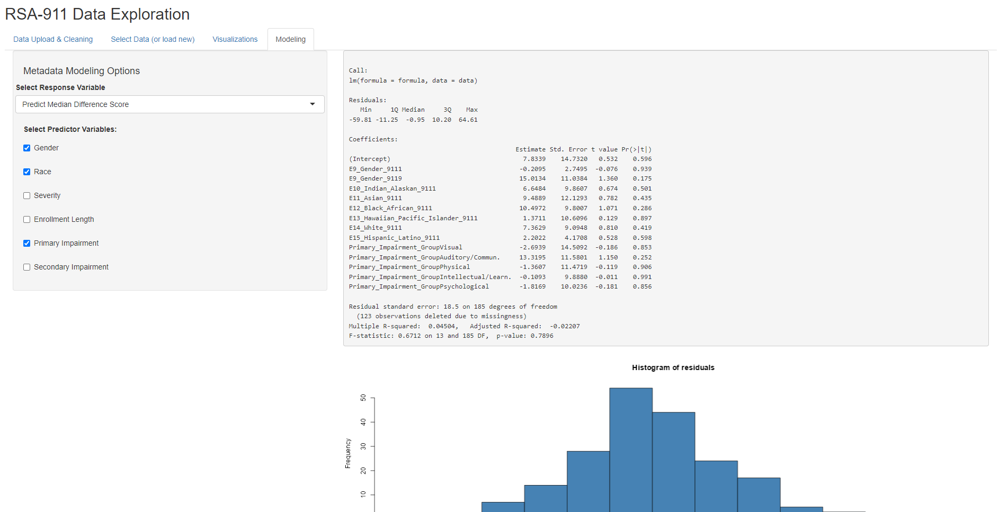{width=500px}

#### Selecting Scores Data
When the user selects "Use Cleaned Scores Data", they have three tabs
with several visuals on each to examine. Some provide general visual summaries of score
distributions, some provide visuals relevant to modeling options. This figure provides an
example of the output.

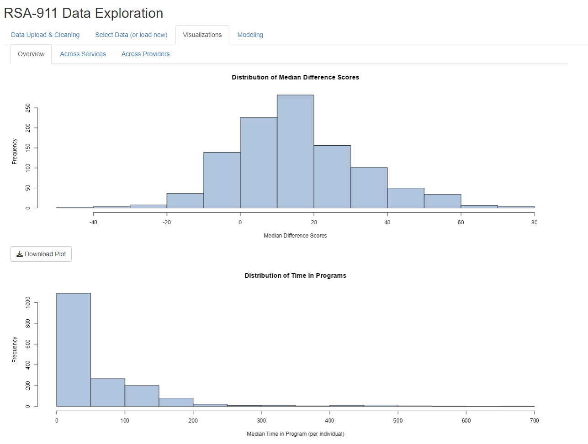{width=500px}

When the user selects "Use Cleaned Scores Data", they have the option of
two different ANOVA models, either for comparing median difference scores across services or
across providers. Once run, the ANOVA output will then be shown, as well as any significant
pairwise comparisons and residual plots.

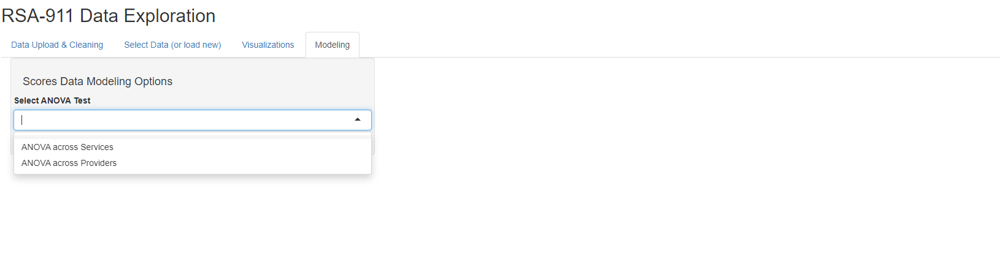{width=500px}
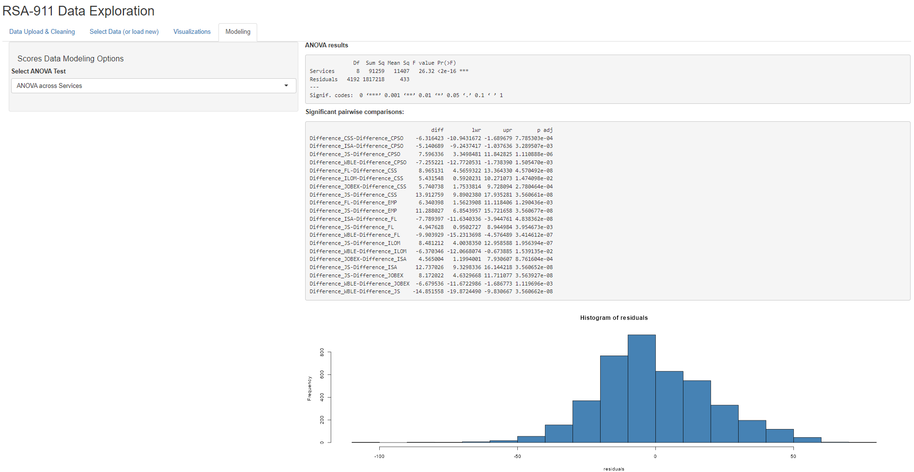{width=500px}

## Conclusion
The `rsa.helpr` package provides VR researchers with a tool to prepare data more efficiently
and consistently, allowing their focus to be on exploration and analysis. Additionally,
through its support in the interactive "RSA-911 Data Exploration" dashboard, `rsa.helpr` provides VR professionals the opportunity to monitor and explore key trends as they do the ground work of data collection. 
As this project is part of ongoing thesis research, there is more refinement left before it is
complete. The majority of the focus will be on the remaining edits and additions to the
package and the dashboard application, as these are the significant contributions to the
field. Once our dashboard is finalized, we
will release it in an online form, so that it can be accessed without requiring R installation.
